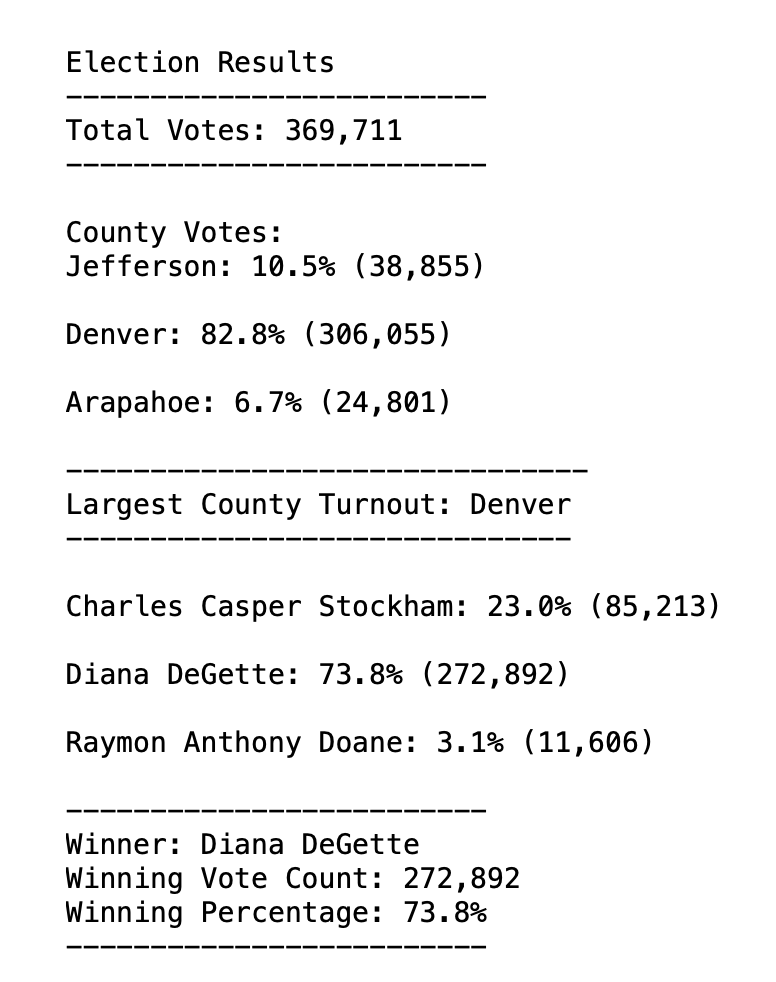

# Election Analysis Report

## Overview of Election Audit: 

The purpose of this analysis is to find the winner of the election and find the county that had the most votes from voters. We found these values as well as total votes, total votes of each county, and total votes of each candidate. Each value was listed as percentages of the total as well.

## Election-Audit Results:

The results of our analysis shows the following
- Total votes in the election was 369,711.
- Votes by county:
	- Jefferson had 38,855 votes which was 10.5% of total votes
	- Denver had 306,055 votes which was 82.2% of total votes
	- Arapahoe had 24,801 votes which was 6.7% of total votes
- Denver county had the largest number of votes with 306,055 votes cast which was 82.2% of all the votes cast.
- Votes by candidate:
	- Diana DeGette had 272,892 votes which was 73.8% of total votes
	- Charles Casper Stockham had 85,213 votes which was 23.0% of total votes
	- Raymond Anthony had 11,606 votes which was 3.1% of total votes
- The winner of the election was Diana DeGette with 272,892 votes and 73.8% of the total votes in this election.

## Election-Audit Summary: to the Election Commission

This code was very efficient in looping through the election data, and returning the accurate total votes and percentage breakdowns of each candidate and county. This code could be used for any election because it creates variables based on where the values are in the CVS file. This code is also universal because it displays the breakdown of the data but also displays the winner of the election. 
Some modifications that could be made to the code would be combining the for loops to hold the necessary variables in one pass and to code the percentage of votes by candidate and county instead of calculating it (see line 127).
